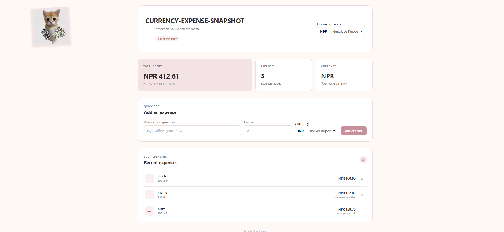

# Currency-expense-snapshot

Currency-expense-snapshot is a simple expense-tracking web application that allows users to add, view, delete, and manage expenses in different currencies. Expenses can be converted into a selected home currency so that the user can easily see their total spending.

## Preview



## Features

* Add an expense with a title, amount, and currency
* View recent expenses
* Delete expenses
* Select a home currency
* Convert expenses into the selected home currency
* Display the total amount spent
* Display the number of expenses
* Support multiple currencies
* Responsive user interface
* In-memory expense storage

## Tech Stack

* **Backend:** Node.js + Express
* **Frontend:** React
* **Storage:** In-memory only
* **Styling:** Plain CSS
* **Development Tool:** Vite
* **Middleware:** CORS

## Supported Currencies

The application supports:

- All available currencies from Frankfurter.

## Setup and Running

### Prerequisites

Make sure you have Node.js and npm installed.

### Backend

Open a terminal and navigate to the backend directory:

```bash
cd backend
```

Install the dependencies:

```bash
npm install
```

Run the backend:

```bash
node server.js
```

The backend runs on:

```text
http://localhost:5000
```

### Frontend

Open another terminal and navigate to the frontend directory:

```bash
cd frontend
```

Install the dependencies:

```bash
npm install
```

Run the frontend:

```bash
npm run dev
```


## Exchange Rate API

This project uses the **Frankfurter API** for currency exchange rates.
No API key is required to use the Frankfurter API, so no API key configuration is necessary.
Currency conversion is handled by the backend through the `/convert` endpoint. The frontend sends the source currency, target currency, and amount to the backend, which retrieves the exchange rate and returns the converted amount.

Example:

```text
GET /convert?from=USD&to=NPR&amount=10


## API Endpoints

### Get all expenses

```http
GET /expenses
```

### Add an expense

```http
POST /expenses
```

Example request:

```json
{
  "title": "Coke zero",
  "amount": 40,
  "currency": "NPR"
}
```

### Delete an expense

```http
DELETE /expenses/:id
```

### Convert currency

```http
GET /convert?from=USD&to=NPR&amount=10
```

## Storage

Expenses are stored **in memory only** using an array in the backend.

This means that expenses will be lost whenever the backend server is restarted.

No database is used for this project.

## Assumptions

* Users can select one home currency for viewing their total spending.
* The supported currencies are available currencies from Frankfurter.
* Expense amounts must be positive numbers.
* Currency conversion is handled by the backend.
* Data persistence is not required because the assignment specifies in-memory storage.
* The application assumes that the backend is running on port `5000`.
* The frontend and backend run separately during development.

## Things I Would Improve With More Time

* Add expense dates and categories.
* Improve validation and error handling.


## Author
Ipshu Upreti


